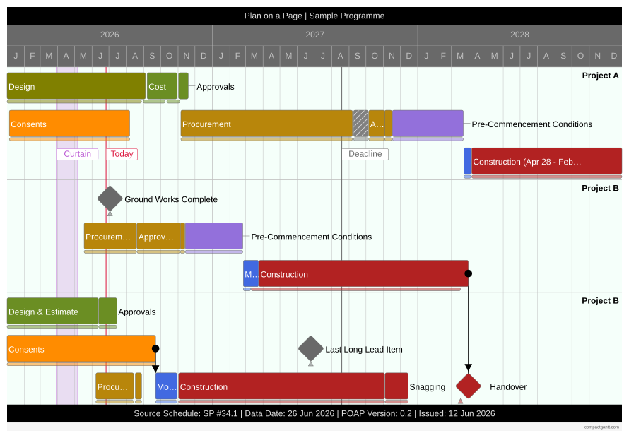
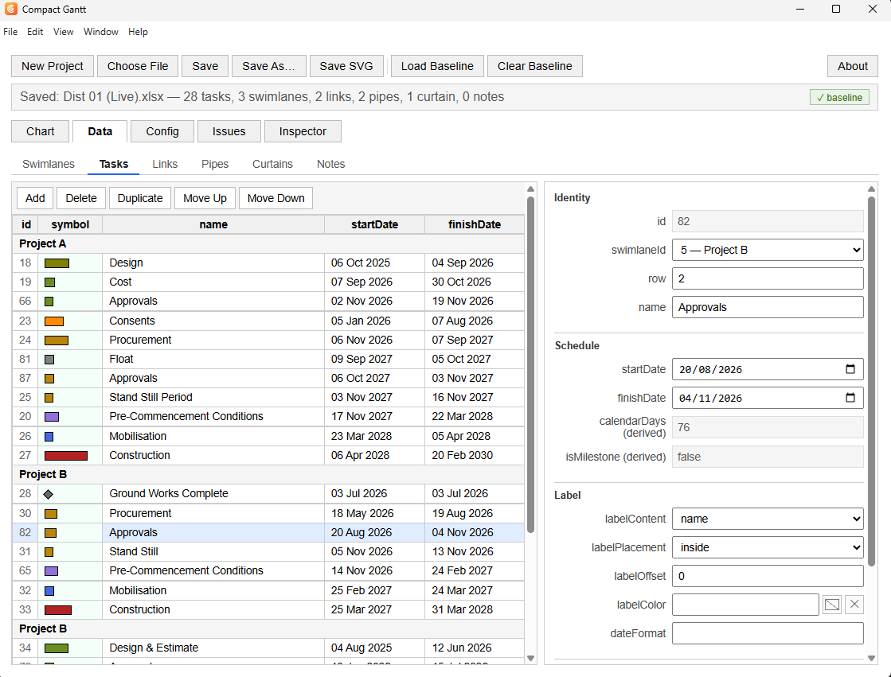
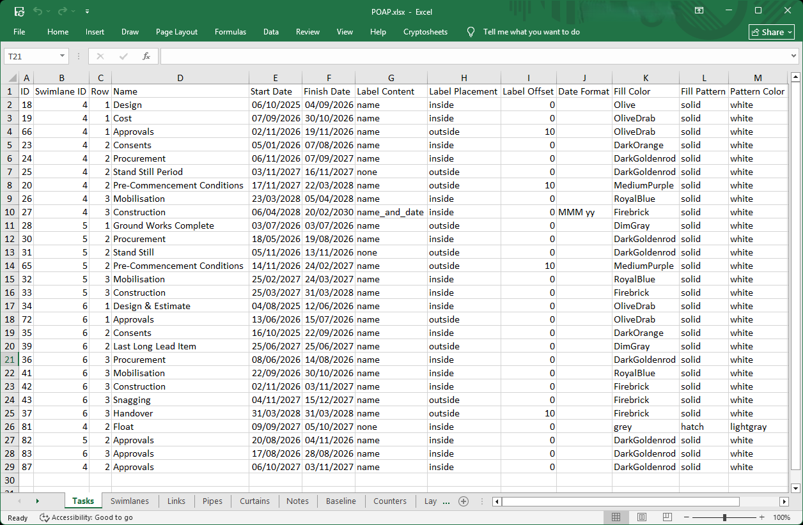

# Compact Gantt

A compact, presentation-ready Gantt chart application — plan on a page, not a scroll.

Compact Gantt renders one-page project schedules from a simple, portable
data model: tasks, swimlanes, dependency links, milestones, and reference
markers, all editable through a dedicated interface or directly in the
underlying spreadsheet.

## Two ways to edit

**Through the app** — a dedicated data-entry interface with inline table
editing, per-entity forms, and live validation.

**Or directly in Excel** — the underlying `.xlsx` file is the single
source of truth; edit it by hand and reload.

## Get it

Compact Gantt runs as a portable Windows desktop application, available
at **[compactgantt.com](https://www.compactgantt.com)**.

## How it's built

The web application itself has no build step, bundler, or framework —
vanilla JavaScript, HTML, and CSS, open directly in a browser. An
optional Electron packaging layer wraps it for standalone desktop
distribution; the packaging layer is the only part of the project that
touches Node.js or a build process.

Architecture and product decisions are mine; implementation was carried
out through structured, AI-assisted engineering practice — close
collaboration with Claude (Anthropic), with dedicated design review and
a maintained technical decision log (`CLAUDE.md`) at every stage of
development.

Richard Hayman-Joyce — [LinkedIn](https://www.linkedin.com/in/haymanjoyce/)

## License

The source code in this repository is published for portfolio and
evaluation purposes — see [`LICENSE`](./LICENSE). The compiled
application, available for purchase at compactgantt.com, is licensed
separately to purchasers under the terms in [`EULA.txt`](./EULA.txt).
